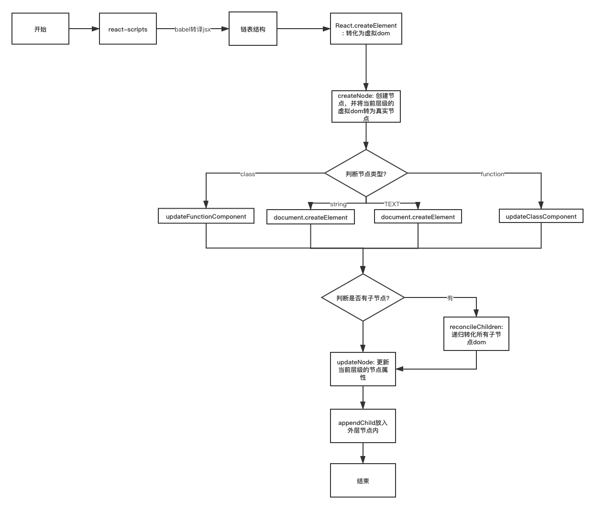

# React CreateElement 实现

在 `create-react-app` 脚手架中，使用 `jsx` 语法会被编译成抽象语法树，放入 `createElement` 中作为参数执行。

所以我们需要在 `createElement` 函数中创建虚拟 `DOM` 并返回

下面我们就一起来看看如何编写 `createElement` 函数以及 `render` 函数

## createElement

在 `react.js` 中创建 `createElement`，`babel` 进行 `compile` 之后会自动调用此方法

- 创建 `React.createElement` 函数，会接受三个参数

  - type：节点类型
  - config: 节点属性
  - children：子节点集合

- 返回一个组合之后的虚拟 `DOM`

  ```js
  export const createElement = (type, config, ...children) => {
    //
    console.log("React createElement >>> ", type, config, children);

    // 设置 key 和 ref 值
    let key = null;
    let ref = null;

    // 设置 props 属性值
    const props = {};
    if (config) {
      if (config.key) {
        key = config.key;
        delete config.key;
      }
      if (config.ref) {
        ref = config.ref;
        delete config.key;
      }
      delete config.__self;
      delete config.__source;
    }

    if (type && type.defaultProps) {
      const { defaultProps } = type;
      Object.keys(defaultProps).forEach(propName => {
        if (!props[propName] && defaultProps[propName]) {
          props[propName] = defaultProps[propName];
        }
      });
    }

    // 这里应该是直接 props.children = children，
    // 但是我们为了简单一点，给文本节点也转换成 vNode对象，React 源码中并没有这么做
    props.children = children.map(child =>
      typeof child === "object" ? child : createTextNode(child)
    );

    return {
      key,
      ref,
      type,
      props
    };
  };
  ```

`babel` 只会对标签进行编译，不会对文本进行组装。
所以为了将文本节点也转化成虚拟 `DOM` 对象，我们添加了一个 `createTextNode` 函数（React 中并没有这么做）。

`createTextNode`

```js
function createTextNode(text) {
  return {
    type: "TEXT",
    props: {
      children: [],
      nodeValue: text
    }
  };
}
```

## `render` 函数

处理 `dom` 渲染

```js
const render = (vNode, container) => {
  const node = createNode(vNode);
  container.appendChild(node);
  console.log("ReactDOM render >>> ", vNode, container, node);
};
```

创建真实 `DOM：createNode`

```js
function createNode(vNode) {
  let node = null;
  const { type, props } = vNode;
  if (type === "TEXT") {
    node = document.createTextNode("");
  } else if (typeof type === "string") {
    node = document.createElement(type);
  } else {
    node = document.createDocumentFragment();
  }

  updateNode(node, props);

  return node;
}
```

为真实 `DOM` 节点设置属性：`updateNode`

```js
/**
 * 更新 DOM 属性
 * @param {*} node 真实 DOM
 * @param {*} nextProps 节点属性
 */
function updateNode(node, nextProps) {
  Object.keys(nextProps)
    .filter(propName => propName !== "children")
    .forEach(propName => {
      if (propName.startsWith("on")) {
        const eventName = propName.slice(2).toLowerCase();
        node.addEventListener(eventName, nextProps[propName]);
      } else {
        node[propName] = nextProps[propName];
      }
    });
}
```

此时代码基本已经完成，但是界面仍然没有内容展示出来。因为还没有对子元素进行渲染。

## 渲染子元素

则此时在 `createNode` 的时候，对子元素进行渲染即可

```js
function createNode(vNode) {
  let node = null;
  const { type, props } = vNode;
  if (type === "TEXT") {
    node = document.createTextNode("");
  } else if (typeof type === "string") {
    node = document.createElement(type);
  } else {
    node = document.createDocumentFragment();
  }

  // !新增代码
  if (props.children) {
    reconcileChildren(props.children, node);
  }

  updateNode(node, props);

  return node;
}
```

新增 `reconcileChildren` 函数对子元素进行循环渲染

```js
function reconcileChildren(children, node) {
  children.forEach(child => {
    if (Array.isArray(child)) {
      reconcileChildren(child, node);
    } else {
      render(child, node);
    }
  });
}
```

## class Component & Function Component

此时只是完成了原始标签的渲染，函数组件以及类组件我们还没有进行操作。

1. 声明一个 `Component` 类作为类组件的父类。
2. 在 `createNode` 中进行判断，分别判断是类组件还是函数组件
3. 由于 `class` 也是由 `function` 实现，因此无法使用 `typeof` 直接区分函数组件和类组件，需要给类组件添加一个原型属性，作为区分
4. `Component.prototype.isReactComponent = {};`

在 `react.js` 中新增 `Component` 类

```js
/**
 * 类组件声明
 * @param {*} props 组件属性
 */
export function Component(props) {
  this.props = props;
}

// 设置 isReactComponent 属性，用来区分类组件和函数组件
Component.prototype.isReactComponent = {};
```

`react-dom.js` 中

在 `createNode` 函数中添加判断条件

```js
function createNode(vNode) {
  let node = null;
  const { type, props } = vNode;
  if (type === "TEXT") {
    node = document.createTextNode("");
  } else if (typeof type === "string") {
    node = document.createElement(type);
  }
  // ! 新增代码
  else if (typeof type === "function") {
    node = type.prototype.isReactComponent
      ? updateClassComponent(vNode)
      : updateFunctionComponent(vNode);
  } else {
    node = document.createDocumentFragment();
  }

  if (props.children) {
    reconcileChildren(props.children, node);
  }

  updateNode(node, props);

  return node;
}
```

新增 `updateClassComponent` 和 `updateFunctionComponent` 函数，返回类组件和函数组件的真实 `DOM`

```js
/**
 * 将类组件转化成真实 DOM
 * @param {*} vNode 虚拟 DOM
 */
function updateClassComponent(vNode) {
  const { type: Type, props } = vNode;
  vNode = new Type(props).render();
  return createNode(vNode);
}

/**
 * 将函数组件 转化成真实 DOM
 * @param {*} vNode 虚拟 DOM
 */
function updateFunctionComponent(vNode) {
  const { type, props } = vNode;
  vNode = type(props);
  return createNode(vNode);
}
```

## 设置默认属性 `defaultProps`

`React` 组件是可以设置默认属性值的，所以这里我们也添加这个功能

修改 `react.js` 中的 `createElement` 函数

```js
export const createElement = (type, config, ...children) => {
  //
  console.log("React createElement >>> ", type, config, children);

  // 设置 key 和 ref 值
  let key = null;
  let ref = null;

  // 设置 props 属性值
  const props = {};
  if (config) {
    if (config.key) {
      key = config.key;
      delete config.key;
    }
    if (config.ref) {
      ref = config.ref;
      delete config.key;
    }
    delete config.__self;
    delete config.__source;

    Object.keys(config).forEach(propName => {
      props[propName] = config[propName];
    });
  }

  if (type && type.defaultProps) {
    const { defaultProps } = type;
    Object.keys(defaultProps).forEach(propName => {
      if (!props[propName] && defaultProps[propName]) {
        props[propName] = defaultProps[propName];
      }
    });
  }

  // 这里应该是直接 props.children = children，
  // 但是我们为了简单一点，给文本节点也转换成 vNode对象，React 源码中并没有这么做
  props.children = children.map(child =>
    typeof child === "object" ? child : createTextNode(child)
  );

  return {
    key,
    ref,
    type,
    props
  };
};
```

## 流程图

